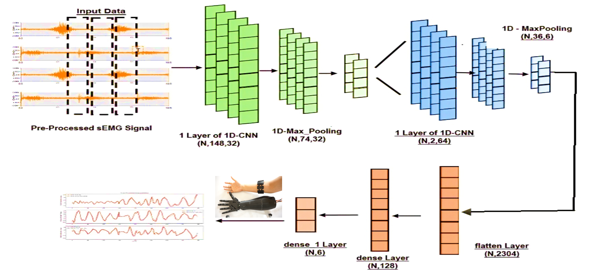

# EMG Signal Classification Using Deep Learning

## Table of Contents
- [Project Overview](#project-overview)
- [Features](#features)
- [Project Structure](#project-structure)
- [Technologies Used](#technologies-used)
- [Installation & Usage](#installation--usage)
- [Pipeline Details](#pipeline-details)
- [Evaluation & Results](#evaluation--results)
- [Future Enhancements](#future-enhancements)
- [License](#license)

## Project Overview

This project presents a robust, end-to-end pipeline for classifying hand gestures from surface Electromyography (sEMG) signals using deep learning. The solution leverages Convolutional Neural Networks (CNNs) and multiple signal processing techniques to achieve high-accuracy gesture recognition, supporting applications such as prosthetic hand control, rehabilitation, and human-computer interaction.

---

## Visual Overview

### CNN Architecture



### Dataset File Structure


---

## Features

- **Automated Data Acquisition:** Downloads and extracts the EMG dataset from Kaggle.
- **Comprehensive Preprocessing:** Cleans, normalizes, and prepares the data for modeling.
- **Multiple Feature Extraction Pipelines:**
  - **Sliding Window Segmentation:** Converts continuous EMG signals into windowed samples.
  - **Fourier Transform:** Extracts frequency-domain features.
  - **Root Mean Square (RMS):** Computes signal energy for each window.
- **Deep Learning Models:** Modular CNN architectures for each feature extraction method.
- **Evaluation Metrics:** Accuracy, F1-score, confusion matrix, and detailed classification reports.
- **Visualization:** Training curves and confusion matrices for model interpretability.
- **Debugging Support:** Integrated with Python's `pdb` for step-by-step debugging.

## Project Structure

```
Classification_of_EMG_Signal.ipynb   # Main Jupyter notebook with the full pipeline
README.md                            # Project documentation
requirements.txt                     # Python dependencies
Resources/                           # Supplementary materials (presentations, images, etc.)
```

## Technologies Used

- **Programming Language:** Python 3.8+
- **Deep Learning:** TensorFlow, Keras
- **Machine Learning:** scikit-learn
- **Signal Processing:** numpy, scipy
- **Data Handling:** pandas
- **Visualization:** matplotlib, seaborn
- **Debugging:** pdb

## Installation & Usage

### Prerequisites

- Python 3.8 or higher
- Kaggle account (for dataset download)
- All required Python libraries (see `requirements.txt`)

### Installation

Clone the repository and install dependencies:

```sh
git clone https://github.com/yourusername/Classification-of-an-EMG-Signal-Using-CNN.git
cd Classification-of-an-EMG-Signal-Using-CNN
pip install -r requirements.txt
```

### Running the Pipeline

1. Open `Classification_of_EMG_Signal.ipynb` in Jupyter Notebook or VS Code.
2. Run all cells sequentially to:
   - Download and prepare the dataset
   - Preprocess and clean the data
   - Extract features (Sliding Window, FFT, RMS)
   - Train and evaluate CNN models for each feature set
   - Visualize results and generate reports

> **Note:** The notebook includes `pdb.set_trace()` statements for debugging. Remove or comment these lines for uninterrupted execution.

## Pipeline Details

### 1. Data Acquisition & Preprocessing
- Downloads the EMG dataset from Kaggle.
- Cleans the data, removes irrelevant classes, and handles missing values.
- Normalizes the signal data for stable model training.

### 2. Feature Extraction
- **Sliding Window:** Segments the signal into overlapping windows for temporal analysis.
- **Fourier Transform:** Converts time-domain signals to frequency-domain features.
- **RMS:** Computes the root mean square value for each window as a robust feature.

### 3. Model Training
- Defines modular CNN architectures for each feature set.
- Trains models using an 80/20 train-test split.
- Supports easy hyperparameter tuning and architecture modification.

### 4. Evaluation & Visualization
- Computes accuracy and F1-score for both training and test sets.
- Generates confusion matrices and classification reports.
- Visualizes training/testing loss and confusion matrices for interpretability.

## Evaluation & Results

- **Accuracy and F1-Score:** Reported for each feature extraction method.
- **Confusion Matrix:** Visualizes model performance across all gesture classes.
- **Classification Report:** Provides per-class precision, recall, and F1-score.

## Future Enhancements

- **On-Device Inference:** Optimize for embedded deployment (e.g., Raspberry Pi, Arduino).
- **Gesture Expansion:** Increase the number of recognizable gestures.
- **Adaptive Learning:** Implement online learning for continuous improvement.
- **Multi-Sensor Fusion:** Integrate additional biosensors for improved robustness.

## License

This project is licensed under the MIT License. See the LICENSE file for details.

---

For questions or contributions, please open an issue or submit a pull request.

